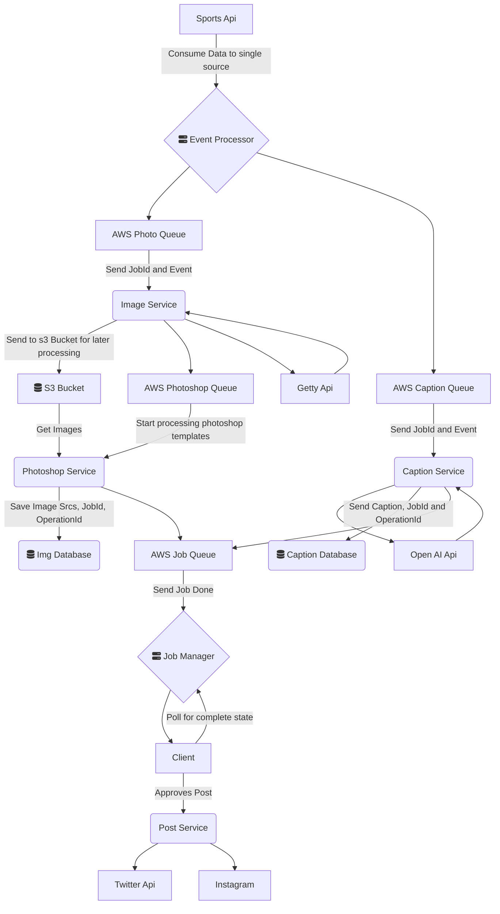

# On The Fly

  

## Architecture

  

### Overview

  

The main logic will be separated in to a few microservices, with each service taking care of a specific use case that will later be combined together for the client.

We will start off with a **_Event Processor_** that will consume all the data from the **Sports Api**. Here we can filter out events based on rules and conditions set by the user or us.

The Event Processor will produce micro events that will be consumed by these main services:

* Caption Service

* Image Service

* Photoshop Service

* Post Service

  

These are the starting services we will need to meet our basic use case for generating posts.

The **_Caption Service_** will take in the micro event and the jobId attached to the event to create a caption. It creates a prompt and send it to Open AI to generate text. All we have to do is send description of what type of caption to create with examples and it will do the large portion of the work. We will then save the captions to the services database with jobId that started it. It will also create an operationId to emphasize this came from the Caption Service.

  

The **_Image Service_** will grab images from Getty Api based on the event. Currently we will keep this relatively simple by searching for the players of the team in the event. Typically this will be the team that the user is linked with.

> However I forsee us using AI to check the image collection for the correct items such as a basketball, the correct player, and even the sentiment of the photo based on the AI's description of the photo

>

Thes photos will be saved to s3 bucket for processing later. We will then add them to image processing queue that will be consumed by the **_Photoshop Service_**

  

The Photoshop Service will consume the images and also take in a json template that will help it transform the PSD template chosen for the event type.

> For example there could be a period_event that will only track the end of each period in an nba game. This event will have one or more templates attached based on the team that is attached to said event'

>

The processor will use the **Photoshop Api** to transform the psd and render the correct images for the post needed.

Once the photos is ready, we send it off to the job queue.

  

The **_Job Manager_** will processs all the operations from each service and will accumulate the results for a post. The client will poll the Job Manager and wait for the job to complete. The client will then receive all the info it needs to create a post. Once the client approves the images and captions, we will send a request to the **_Post Service_** to make a post on behalf of the user.

### Design
  

